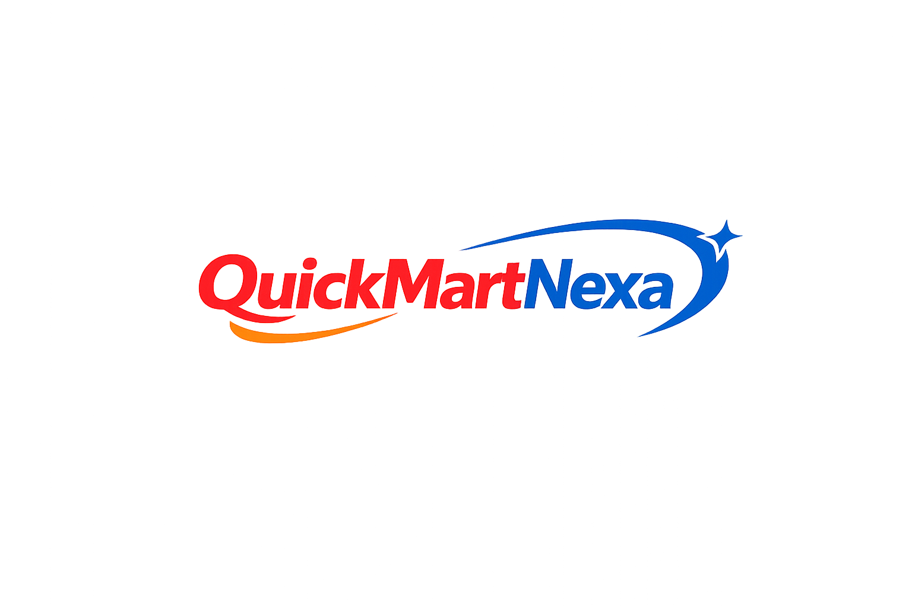

<div align="center">
  
  
  # Quickmart Nexa
  
  **A Next-Generation Multi-Vendor E-Commerce Platform**
  
  [](https://angular.io/)
  [](https://nodejs.org/)
  [](https://expressjs.com/)
  [](https://www.mongodb.com/)
  [](https://tailwindcss.com/)
</div>

---

## 🚀 Overview

**Quickmart Nexa** is a premium, full-stack, multi-vendor e-commerce platform built to seamlessly connect buyers and sellers. Featuring a highly aesthetic, glassmorphism-inspired UI, it provides dedicated dashboards for Administrators, Sellers, and Customers, ensuring a fluid and secure shopping experience.

The platform is designed with scalability in mind, utilizing a robust **Node.js/Express** backend backed by **MongoDB**, paired with a cutting-edge **Angular 17+** frontend styled with **Tailwind CSS**.

## ✨ Key Features

### 🛒 For Customers
*   **Dynamic Product Catalog:** Browse a rich, paginated catalog with advanced filtering and real-time search.
*   **Smart Shopping Cart:** Seamless cart and checkout flow with integrated order tracking.
*   **Secure Profiles:** Dedicated user profile management, login history tracking, and order history viewing.
*   **Product Reviews:** Leave ratings and rich text reviews on purchased products.

### 🏪 For Sellers
*   **Seller Application Flow:** Automated onboarding system to become a verified seller.
*   **Dedicated Seller Dashboard:** Real-time revenue analytics, order status breakdowns, and active product metrics.
*   **Inventory Management:** Easily add, edit, and track product stock globally.
*   **Order Fulfillment:** Track and update the status of incoming orders (`Pending` -> `Processing` -> `Shipped` -> `Delivered`).

### 🛡️ For Administrators
*   **Global Command Center:** A stunning dashboard tracking platform-wide revenue, active users, total orders, and system health.
*   **Advanced User Management:** Easily block, unblock, or delete users with real-time analytics on active vs. restricted accounts.
*   **Global Activity Auditing:** A powerful real-time interceptor logging every action taken on the platform (Method, Route, Duration, Role, IP) complete with detailed drill-down modals.
*   **Content & Catalog Approval:** Approve or reject new sellers and products before they go live on the platform.

## 🛠️ Technology Stack

**Frontend Architecture:**
*   **Framework:** Angular (Standalone Components)
*   **Styling:** Tailwind CSS (Custom glassmorphism UI, micro-animations)
*   **State Management:** RxJS & Angular Services
*   **Data Visualization:** Chart.js

**Backend Architecture:**
*   **Environment:** Node.js
*   **Framework:** Express.js
*   **Database:** MongoDB & Mongoose
*   **Security:** JWT Authentication, Role-based Access Control (RBAC), Helmet, Rate Limiting, CORS Configuration
*   **Performance:** Response Compression, Pagination

## ⚙️ Installation & Setup

### Prerequisites
*   Node.js (v18+)
*   MongoDB (Local or Atlas URI)
*   Angular CLI

### 1. Clone the repository
```bash
git clone https://github.com/yourusername/Quickmart-Nexa.git
cd Quickmart-Nexa
```

### 2. Backend Setup
```bash
cd Backend
npm install
```
Create a `.env` file in the `Backend` directory:
```env
PORT=5000
MONGO_URI=your_mongodb_connection_string
JWT_SECRET=your_jwt_secret_key
FRONTEND_URL=http://localhost:4200
```
Start the backend server:
```bash
npm run dev
```

### 3. Frontend Setup
```bash
cd Quickmart_frontend
npm install
```
Start the Angular development server:
```bash
npm start
```
The application will be running at `http://localhost:4200`.

## 🔒 Security & Performance

*   **Global Activity Logger:** All API traffic is securely audited, recording user roles and actions without impacting latency.
*   **Secure API Endpoints:** Protected by JWT verification middleware ensuring users only access authorized data.
*   **Rate Limiting & Compression:** Prevents DDoS attacks and significantly reduces payload sizes for faster rendering.

---

<div align="center">
  <i>Built with ❤️ for modern e-commerce</i>
</div>
